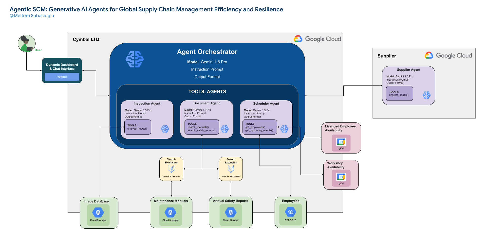

# 🤖 Agentic Supply Chain Maintenance (ASCM)

**ASCM** is an application that leverages Large Language Models (LLMs) and the power of agents to streamline and enhance maintenance and logistics processes within a supply chain context.

## 📂 Repo Structure
Here's a breakdown of the repository's structure:

|Folder/File|Description|
|:---|:---|
|Agents/|Contains the definitions and implementations of all agents.|
|Files/|This folder stores various files, including images, templates, and other resources, serving as a placeholder for data and assets used by the agents.|
|Tools/|Includes utility scripts, helper functions, and external libraries that support the core functionalities of the agents and the application.|
|TL-2000_StingSport.jpg|An image file for testing purposes.|
|main.py|The primary entry point of the ASCM backend application. Good for testing.|
|settings.yaml|A configuration file storing settings and parameters for the application.|
|streamlit_frontend.py|Implements the user interface of the ASCM application using Streamlit.|
|.gitignore|Specifies files and folders to be excluded from version control.|
|session_handler.py|Provides a chat session manager for interacting with Gemini models.|
|tool_instructions.py|Contains functions to return tool instructions based on available tools.|
|agent_definitions.py|Defines the functionalities and behaviors of different agents.|
|core.py|Implements the core functionalities of the agent interactions.|
|orchestrator.py|Defines an orchestrator agent that manages and calls other agents.|
|python_functions.py|Contains various Python functions used by the agents.|
|__init__.py|Marks directories as Python packages.|
|__init__ copy.py|Implements utility functions for running Python functions and managing tool instructions.|

## 🚀 Getting Started

### 🛠️ Prerequisites
Before running the application, ensure you have the following prerequisites:

- **Python 3.9 or later**
- **Virtual environment** (recommended)
- **Required packages** (install via `pip install -r requirements.txt`)

### ⚙️ Setup
1. Clone the repository: `git clone git@github.com:5Y5TEM/agentic_scm.git`
2. Navigate to the project directory: `cd agentic_scm`   

3. Create and activate a virtual environment (optional but recommended).
4. Install required packages: `pip install -r requirements.txt`
5. Configure your settings in `settings.yaml`, including your Google Cloud project ID and any API keys. Make sure to remove the (template) from the filename. 

### 🏃 Run the Application
1. Execute the main script: `streamlit run streamlit_frontend.py`
2. Access the Streamlit frontend in your web browser.

## 🧑‍💻 How to Use
1. **Upload an image** for analysis using the sidebar.
2. **Type your questions or requests** in the chat interface.
3. **Review the responses** provided by the agents.
4. **Follow any instructions** or prompts given by the agents.

## 📝 Example Usage
* **Image Analysis:** Upload an image of an aircraft part to have the InspectorAgent analyze it for damage.
* **Document Retrieval:** Ask questions about aircraft manuals or safety reports to get relevant information from the DocumentAgent.
* **Schedule Coordination:** Request the ScheduleAgent to find an expert for a specific task and check their availability.

**Note:** The application's capabilities and responses will depend on the training data and functionalities of the underlying LLMs and agents.
